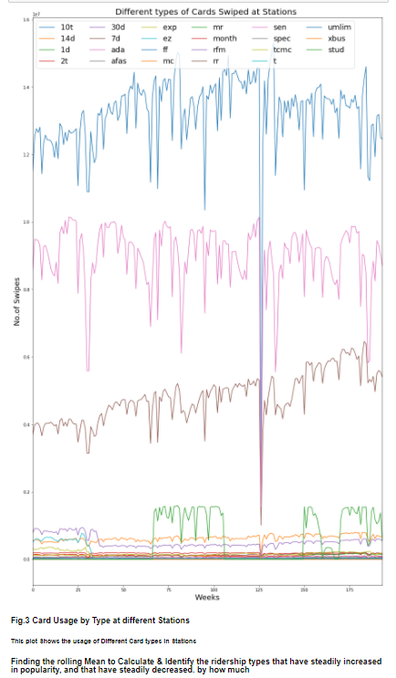

## TIME SERIES ANALYSIS
G### oal: Find outliers, trends and periodicity in the MTA turnstile data
#### DATA:
MTA subway fares. It is a complete dataset of rides logged by card swipes for 600 Manhattan stations.
The data was organized by Dr. Sina Kashuk at CUSP. You can get it from the github repo (use the download link to download it live in your notebook). It contains 23 different subway card types (e.g. monthly pass, daily pass, Act for Disability pass…) 

### Each time series (per station, per ticket type) contains the number of swipes per week for 194 weeks from 05/21/2010 to 02/21/2014.
### The data are available as a python data cube. loaded as
np.load(“MTA_Fare.npy")
and you will end up with a python numpy array of shape (600, 23, 194)
### Task 1:
Event detection: Identify the most prominent event. There is a very significant drop (>3-sigma) in all time series.
Identify it, figure out the date (you know when the data starts and what the cadence is) and figure out what it is due to.
### Task 2:
Some of the time series are stationary, some have a complex structure, some show a downward trend: Identify the ridership types that have steadily increased in popularity, and that have steadily decreased. by how much? (e.g what is the ratio of usage in the first 10 and last 10 weeks)
### Task 3:
Several stations show a prominent annual periodicity. Identify the 4 stations (indentify them by the index of their location in the data cube) that show the most prominent periodic trend on an annual period (52 weeks). (Can you figure out what the periodic peak in rides is due to?)
### Cluster.
Cluster the time series, i.e. identify groups of time series that look similar among each other. You can use KMeans for example to identify common trends, or PCA (Principle Component Analysis).

